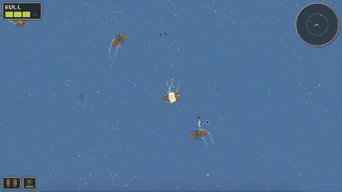

# PirateShipGame

A pixel-art top-down pirate ship arena game built in Godot 4.6.


<p align="center">
  
</p>

## Play it in the browser

_Once the GitHub Pages deploy lands, this link will point at the live
build:_
**https://curiouscrow123.github.io/PirateShipGame/**

Workflow lives at [.github/workflows/deploy-pages.yml](.github/workflows/deploy-pages.yml).
First deploy time is 2-4 minutes; subsequent deploys ~60-90s. Initial
browser load is ~20-40 MB of `.wasm` + `.pck`, expect a 5-15 second
loading bar on first visit.

## Features

- **Handwritten water shader** — tile-grid surface with player wake
  displacement, cannonball impact ripples, and sea-mine bob (see
  [docs/pixel-water-shader-reference.md](docs/pixel-water-shader-reference.md)).
- **Composable component architecture** — every gameplay verb lives
  in its own `Node` under the entity root (9 ship components + FSM);
  signal-up, default-OFF ticks, `@export` Resources for tuning. See
  [docs/architecture/03-entities-and-components.md](docs/architecture/03-entities-and-components.md).
- **Linear wave progression** — tuned per-wave enemy counts, spawn
  cadence, and difficulty multipliers via `WaveConfig` + `WaveSet`
  Resources.
- **Stylized explosion atlases** — baked sprite atlases instead of
  real-time 3D particles, authored via an editor plugin. See
  [ADR 002](docs/decisions/002-prerendered-explosion-atlases.md).
- **Sea mines with chain reactions** — dropped in your wake,
  proximity-armed, chain-detonate nearby mines on impact.
- **Pixel-crisp minimap + controls overlay** — 640×360 viewport at
  2× integer scale, `Nearest` filter, pixel-snapped 2D transforms.

## Controls

From [features/hud/controls_overlay.tscn](features/hud/controls_overlay.tscn):

| Key | Action |
|---|---|
| **W** | Sail forward |
| **S** | Decelerate |
| **A** | Turn left |
| **D** | Turn right |
| **Left arrow** | Fire left cannons |
| **Right arrow** | Fire right cannons |
| **Down arrow** | Drop sea mine |
| **Space** | Speed boost (dash) |
| **F11** | Toggle fullscreen |
| **0** | Toggle debug overlay |

## Running the game

1. Install Godot **4.6.1** (mono not required — this is a pure
   GDScript project).
2. Open [project.godot](project.godot) in the editor.
3. Press **F5** to launch the main scene
   ([main/main.tscn](main/main.tscn)).

The first launch takes longer because Godot imports all textures,
shaders, and `.tres` resources into `.godot/`.

## Tech stack

- **Engine**: Godot 4.6.1
- **Language**: GDScript (statically typed — see
  [CLAUDE.md](CLAUDE.md) "GDScript Conventions")
- **Renderer**: GL Compatibility (Web-export target; see
  [docs/architecture/01-overview.md](docs/architecture/01-overview.md))
- **Viewport**: 640×360 logical, 1280×720 window (2× integer scale)
- **Stretch mode**: `viewport` with integer scaling + pixel snap
- **Physics**: Jolt (2D interpolation on)

## Project structure

```
addons/    — vendored GUT + first-party editor plugins
assets/    — shared textures, fonts
autoload/  — Events, GameState, AudioManager, KeybindsManager
docs/      — plans, decisions (ADRs), brainstorms, architecture tour
features/  — camera/, enemies/, hud/, ship/, vfx/, water/, waves/,
             weapons/ — each owns its scripts, scenes, resources
main/      — main.tscn + main.gd
systems/   — cross-feature helpers + service Nodes
tests/     — GUT unit tests
```

More detail + inclusion criteria in [CLAUDE.md](CLAUDE.md) "Folder
Structure".

## Architecture at a glance

Main.gd is a thin orchestrator — assertion gate on `@onready` refs +
cross-service wiring, no per-frame logic. Gameplay lives on the
`Ship` entity (10 components + FSM) and sibling service Nodes
(`WaveDirector`, `SpawnService`, `StatsTracker`,
`WaterEffectsManager`). Cross-system communication goes through the
typed `Events` autoload bus. Tuning lives in read-only `Resource`
templates (`ShipStats`, `WaveConfig`, `ExplosionStats`, etc.).

For the full tour, read **[docs/architecture/README.md](docs/architecture/README.md)**.
14 architectural decision records are in
[docs/decisions/](docs/decisions/).

## Development

```bash
# Format + lint (run before commits — see CLAUDE.md "Linting")
find . -name "*.gd" -not -path "./addons/*" -not -path "./.git/*" \
  -not -path "./.godot/*" -print0 | xargs -0 gdformat --check
gdlint .

# Unit tests (GUT, headless)
/Applications/Godot.app/Contents/MacOS/Godot --headless --path . \
  -s addons/gut/gut_cmdln.gd -gdir=res://tests/unit -gexit
```

Full coding conventions, testing patterns, and the Resource safety
doctrine are documented in [CLAUDE.md](CLAUDE.md).

## License

MIT — see [LICENSE](LICENSE). This covers the source code and
first-party assets in this repository.

## Credits

All code and assets in this repository are self-made unless
otherwise noted. Godot Engine is © Juan Linietsky, Ariel Manzur, and
contributors, licensed under MIT.
