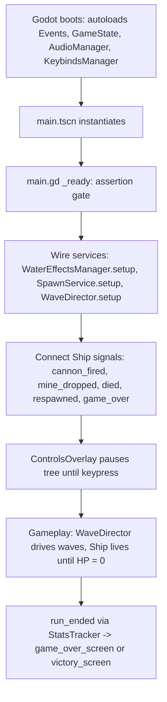

<!-- verified against commit 090ed90 on 2026-04-08 -->

# 01 — Overview

## What you'll know after reading this

- What PirateShipGame actually is, in one paragraph.
- Which Godot version, renderer, and viewport/stretch settings it uses.
- What happens between "press F5" and "the ship is taking damage."
- What each top-level node in [main.tscn](../../main/main.tscn) is
  responsible for, at a glance.

## The game in three sentences

PirateShipGame is a top-down pixel-art arena where you sail a ship,
fire broadsides, and drop sea mines against increasingly aggressive
enemy vessels. Runs are driven by a linear wave set — clear the wave,
brief intermission, next wave — until you either clear the campaign or
run out of lives. The visual signature is a tile-grid water shader
with player-wake displacement and stylized explosion atlases.

## Engine and display settings

Ground truth lives in [project.godot](../../project.godot).

| Setting | Value | Notes |
|---|---|---|
| Engine | Godot **4.6.1** | `config/features = ("4.6", "Forward Plus")` |
| Renderer | `gl_compatibility` | Mobile + Web target. The "Forward Plus" feature tag is a creation-time marker; the runtime renderer is GL Compatibility (needed for the Web export — see [04-resources-and-vfx.md](04-resources-and-vfx.md) and Phase 3 of the docs plan). |
| Main scene | `res://main/main.tscn` | [main/main.tscn](../../main/main.tscn) |
| Viewport | **640 × 360** | `window/size/viewport_*` |
| Window | **1280 × 720** | 2× integer scale via `window_*_override` |
| Stretch mode | `viewport` | Integer scaling + pixel snapping (see CLAUDE.md "Display Settings") |
| Physics | Jolt 3D, 2D interpolation **on** | `common/physics_interpolation=true` |

The per-project linting, component, and Resource rules live in
[CLAUDE.md](../../CLAUDE.md); this tour explains *what is there*, not
*what the rules are* — cross-link rather than duplicate.

## Autoloads (registered in this order)

From [project.godot](../../project.godot) `[autoload]`:

1. **Events** — [autoload/events.gd](../../autoload/events.gd) — typed signal bus.
2. **GameState** — [autoload/game_state.gd](../../autoload/game_state.gd) — per-run *aggregate* snapshot (current wave index, RunStats accumulator, HP/lives mirrored from the Ship for HUD reads). It does **not** own respawn state — that lives on `HealthComponent` on the Ship (HP + respawn timer + death/respawn signals). `GameState` is the aggregate; `HealthComponent` is the mechanism.
3. **AudioManager** — [autoload/audio_manager.gd](../../autoload/audio_manager.gd) — bus subscriber for `sound_requested`.
4. **KeybindsManager** — [autoload/keybinds_manager.gd](../../autoload/keybinds_manager.gd) — remap + gamepad + persistence.

Events is first on purpose — anything connecting to the bus in its own
`_ready()` finds the signals already declared. Cross-autoload
references only happen inside `_ready()` or later, never at file
scope. See [02-autoloads-and-signals.md](02-autoloads-and-signals.md).

## Run loop — what happens when you press F5

[main/main.gd](../../main/main.gd) is a deliberately thin orchestrator
(ADR 010). Its only jobs are: assertion gate on `@onready` refs,
cross-service wiring (`setup()` calls + signal `.connect()` calls),
scene-level input toggles (`toggle_fullscreen`,
`toggle_explosion_mode`), and a camera snap on `Ship.respawned` so
smoothing doesn't rubber-band the view from the death location. Wave
lifecycle lives on [features/waves/wave_director.gd](../../features/waves/wave_director.gd),
spawning on [systems/spawn_service.gd](../../systems/spawn_service.gd),
run stats on [systems/stats_tracker.gd](../../systems/stats_tracker.gd),
and water displacement on
[features/water/water_effects_manager.gd](../../features/water/water_effects_manager.gd).
Each is a `Node` child of `Main` with its own `setup()` contract.

## Annotated scene tree

From [main/main.tscn](../../main/main.tscn). Children grouped by role;
HUD subtree collapsed for brevity.

| Node | Type / Script | Role |
|---|---|---|
| `Main` | `Node2D` / [main/main.gd](../../main/main.gd) | Root orchestrator — `_ready()` asserts + wires services |
| `SpawnPoint` | `Marker2D` | Respawn position used by `Ship._on_ship_respawned` |
| `Ship` | [features/ship/ship.tscn](../../features/ship/ship.tscn) | The player — 10 components + visuals. See [03-entities-and-components.md](03-entities-and-components.md) |
| `ChunkContainer` | [features/water/water_chunk_manager.gd](../../features/water/water_chunk_manager.gd) | Streams water tile chunks around the ship |
| `WaterTrail` | `Node2D` | Holds the wake-trail SubViewport pipeline |
| `WaterTrail/SubViewport/Line2D` | [features/water/trails.gd](../../features/water/trails.gd) | Player wake line sampled into a render target |
| `DisplacementViewport/SubViewport/Stamps` | [features/water/displacement_stamps.gd](../../features/water/displacement_stamps.gd) | Draws displacement stamps into the shared displacement map |
| `Minimap`, `ControlsOverlay`, `DebugOverlay`, `HPDisplay`, `WaveToast`, `LivesDisplay`, `GameOverScreen`, `VictoryScreen`, `MineCooldownDisplay` | scenes under [features/hud/](../../features/hud/) | HUD — each gets a `setup(ship)` call or subscribes to Events directly |
| `GameCamera` | [features/camera/game_camera.tscn](../../features/camera/game_camera.tscn) | Follows Ship; subscribes to `Events.screen_shake_requested` |
| `WaveDirector` | [features/waves/wave_director.gd](../../features/waves/wave_director.gd) | Wave FSM (INTERMISSION → SPAWNING → CLEARING → ENDED) |
| `SpawnService` | [systems/spawn_service.gd](../../systems/spawn_service.gd) | Owns the authoritative enemy + mine arrays, spawns projectiles |
| `StatsTracker` | [systems/stats_tracker.gd](../../systems/stats_tracker.gd) | Owns `RunStats`; shows game-over/victory screens on `run_ended` |
| `WaterEffectsManager` | [features/water/water_effects_manager.gd](../../features/water/water_effects_manager.gd) | Wires wake/displacement SubViewports + publishes per-frame displacement events |
| `VfxListener` | [features/vfx/vfx_listener.gd](../../features/vfx/vfx_listener.gd) | Subscribes to `Events.explosion_requested`, spawns explosion sprites |
| `WaterListener` | [features/water/water_listener.gd](../../features/water/water_listener.gd) | Subscribes to `Events.displacement_*_requested`, forwards to `Stamps` |

A few notable absences: there is no "PlayerController" node, no
singleton "CombatManager" — gameplay state lives on `Ship` + its
components, cross-system communication goes through `Events`, and
`Main` itself holds no per-frame logic beyond input toggles.

## Why `main.gd` is thin (ADR 010 in one paragraph)

Before the Phase 7/10 refactors, `main.gd` had accumulated respawn
timers, wave spawn arrays, RunStats mutation, and
`water_impact_requested` forwarding. Each of those is now either a
sibling service (`WaveDirector`, `SpawnService`, `StatsTracker`,
`WaterEffectsManager`) or a bus subscriber
(`VfxListener`/`WaterListener`). The rule: if Main would hold state
across frames, that state belongs on a dedicated sibling Node with its
own `setup()` contract. Main's job is the *assertion gate* and the
*wiring*, nothing else. See `ADR 010` for the full rationale.

## What to read next

- **If you want to understand the player ship** →
  [03-entities-and-components.md](03-entities-and-components.md).
- **If you want to see how signals flow across the scene** →
  [02-autoloads-and-signals.md](02-autoloads-and-signals.md).
- **If you want the Resource / water / VFX pipeline** →
  [04-resources-and-vfx.md](04-resources-and-vfx.md).
