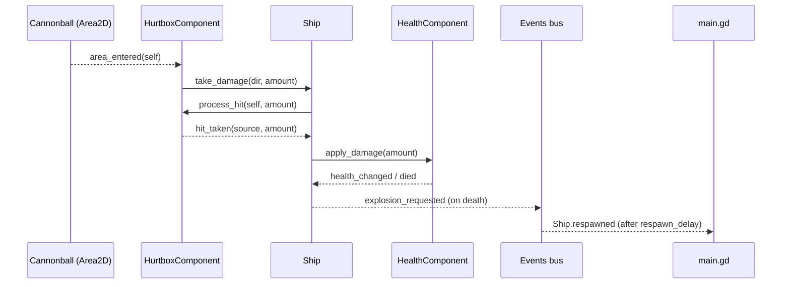

<!-- verified against commit 090ed90 on 2026-04-08 -->

# 02 — Autoloads and Signals

## What you'll know after reading this

- The four autoloads, why they exist, and what each one owns.
- The `Events` bus signal inventory grouped by domain.
- The discipline rules for what belongs on the bus and what does not.
- One end-to-end signal trace — player taking cannonball damage — as a
  Mermaid `sequenceDiagram`.

## Autoload load order

Registered in [project.godot](../../project.godot) in this order:

1. `Events` — [autoload/events.gd](../../autoload/events.gd)
2. `GameState` — [autoload/game_state.gd](../../autoload/game_state.gd)
3. `AudioManager` — [autoload/audio_manager.gd](../../autoload/audio_manager.gd)
4. `KeybindsManager` — [autoload/keybinds_manager.gd](../../autoload/keybinds_manager.gd)

`Events` is first so any subscriber connecting in its own `_ready()`
finds the signals already declared. **Cross-autoload references live
only inside `_ready()` or later, never at file scope** — see ADR 008
rationale on `preload()`. Concretely: no `const Evt = preload(...)` of
one autoload inside another.

## `Events` — the signal bus

[autoload/events.gd](../../autoload/events.gd) is a `Node` with no
emitters or subscribers of its own. It just *hosts typed signals* so
cross-system publishers and subscribers have a stable connection
point. All signals are declared under a `@warning_ignore_start(
"unused_signal")` block because the linter can't see that emitters
live elsewhere.

### Combat

| Signal | Payload | Published by |
|---|---|---|
| `player_damaged` | `amount: int, source: Node` | `Ship._apply_damage` |
| `player_died` | — | `Ship` (via FSM death) |
| `player_respawned` | — | `Ship._on_health_respawn_ready` |
| `enemy_damaged` | `enemy, amount, source` | `EnemyShip._apply_damage` |
| `enemy_destroyed` | `enemy, by_mine: bool` | `EnemyShip` on death |

### Waves

| Signal | Payload | Published by |
|---|---|---|
| `wave_announced` | `index: int` | `WaveDirector` (intermission start) |
| `wave_started` | `index, enemy_count` | `WaveDirector` |
| `wave_cleared` | `index, duration: float` | `WaveDirector` |
| `run_ended` | `stats: RunStats, victory: bool` | `StatsTracker` |

### World / VFX

| Signal | Payload | Published by |
|---|---|---|
| `explosion_requested` | `pos, kind: StringName, dir, vel` | Ship/EnemyShip on death, Cannonball on impact, SpawnService on mine detonation |
| `screen_shake_requested` | `trauma: float` | `HitFeedbackComponent` (sanctioned) |
| `camera_zoom_punch_requested` | `scale_amount, duration` | bosses / chain-explosions |
| `mine_dropped` | `pos: Vector2` | `Ship.mine_dropped` re-emit |
| `cannonball_fired` | `pos, dir, by_player: bool` | `SpawnService` on spawn |
| `cannonball_water_impact` | `pos: Vector2` | `Cannonball` on lifetime end |

### Water displacement (Phase 9 Step 42)

| Signal | Payload | Publisher(s) → Subscriber |
|---|---|---|
| `displacement_impact_requested` | `pos, radius_px, duration` | `WaterEffectsManager`, `SpawnService` → `WaterListener` |
| `displacement_wake_ring_requested` | `pos: Vector2` | `WaterEffectsManager` → `WaterListener` |
| `displacement_bob_requested` | `pos, phase: float` | `WaterEffectsManager` → `WaterListener` |

These fire at ~5 emits/frame and were the reason the "high-frequency
signals stay off the bus" rule got dropped in Phase 9. The measured
dispatch cost of a typed value-type signal with one listener was
negligible compared to the win of a single uniform rule. See the
block comment at the top of
[autoload/events.gd](../../autoload/events.gd).

### Audio

| Signal | Payload | Publisher → Subscriber |
|---|---|---|
| `sound_requested` | `sound_id: StringName, pos: Vector2` | `AudioEmitterComponent` (sanctioned) → `AudioManager._on_sound_requested` |

`sound_id` is a `StringName` — interned, cheap hash compare — and is
intentionally **not** named `name`, which would shadow `Node.name`.

### Meta / stats

| Signal | Payload | Publisher → Subscriber |
|---|---|---|
| `kill_recorded` | — | `EnemyShip` death → `StatsTracker` |
| `death_recorded` | — | `Ship` death → `StatsTracker` |
| `damage_recorded` | `amount: int` | `Ship._apply_damage` → `StatsTracker` |
| `wave_time_recorded` | `index, seconds` | `WaveDirector` → `StatsTracker` |
| `cheat_toggled` | `cheat_id: StringName, active: bool` | debug toggles → `WaveToast` etc. |

`cheat_id` and `sound_id` are both `StringName` and avoid shadowing
`Node.name`. Use the same naming convention for any new bus signal
that carries an enum-like identifier.

## Bus discipline (ADR 007 in four bullets)

1. **Components do not touch `Events` directly.** Emit upward to the
   entity root (`Ship` / `EnemyShip` / `WaveDirector` /
   `SpawnService`), which re-emits to the bus.
2. **Two sanctioned exceptions.** `HitFeedbackComponent.screen_shake_requested`
   and `AudioEmitterComponent.sound_requested` publish directly.
   Routing them through the entity root would be a pointless one-line
   forwarder because they are terminal-output components.
3. **Bus payloads must be typed.** No untyped `Dictionary` payloads.
4. **Listener owns the work — no proxy listeners.** If a signal has a
   single natural receiver (e.g. `Events.screen_shake_requested` →
   `GameCamera`), connect it directly. `VfxListener` /
   `WaterListener` exist only because their signals have *many* spawn
   sites and need a persistent scene-graph parent for the spawned
   child nodes.

## `GameState` — per-run snapshot + RunStats

[autoload/game_state.gd](../../autoload/game_state.gd) holds the
mutable state that outlives any single scene: current wave index, HP
and lives snapshot for the HUD, and the authoritative `RunStats`
accumulator. Its API is methods only — no public mutable `var` — so
callers go through `start_new_run()`, `record_damage(amount)`,
`record_kill()`, `record_death()`, `record_wave_time(i, seconds)`,
and the `get_*` readers.

Why an autoload and not a sibling `Node` of `Main`? Because
`StatsTracker` (the sibling Node version) was what lived there before
Phase 7, and the game-over / restart loop needs something that
survives scene reloads. ADR 008 documents the "merged into autoload,
methods-only API" decision.

## `AudioManager` — bus subscriber stub

[autoload/audio_manager.gd](../../autoload/audio_manager.gd) currently
subscribes to `Events.sound_requested` and has an `_on_sound_requested`
hook. A future `SoundLibrary` Resource + pooled `AudioStreamPlayer2D`
live here — ADR 011 describes the intended shape — but today the
autoload exists primarily so that `AudioEmitterComponent` has a
stable target. See ADR 011 for the staged plan.

## `KeybindsManager` — remap + gamepad + persistence

[autoload/keybinds_manager.gd](../../autoload/keybinds_manager.gd) is
the shim between the `InputMap` baked into
[project.godot](../../project.godot) and a
`user://keybinds.cfg` file. Public API: `has_gamepad()`,
`rebind_action(action, event)`, `add_binding(action, event)`,
`get_bindings(action)`, `reset_to_defaults()`, `save()`. It emits
`gamepad_connected(device)`, `gamepad_disconnected(device)`, and
`bindings_changed(action)` on its own `KeybindsManager` namespace, not
through `Events` — keybind changes are a UI concern, not a
cross-gameplay-system event. See ADR 012.

## The end-to-end damage trace

One player-damage flow, all the way from the cannonball's
`area_entered` to `main.gd` snapping the camera on respawn:

**Convention** (Appendix C of the docs plan):
- `->>` is a direct method call.
- `-->>` is a signal emission.

Two of the steps above cross the entity boundary but *do not* go
through the bus: `HurtboxComponent → Ship` (hit_taken) and `Ship →
HealthComponent` (apply_damage). Those are parent-child relationships
within a single scene instance and stay local. Only `explosion_requested`
and `Ship.respawned` (re-emitted onto `Main.gd`'s connection) cross
into bus territory.

## What to read next

- **Resource catalog, hot-reload rules, water pipeline pointer** →
  [04-resources-and-vfx.md](04-resources-and-vfx.md).
- **The component table referenced above** →
  [03-entities-and-components.md](03-entities-and-components.md).
- **The scene tree these signals live on** →
  [01-overview.md](01-overview.md).
