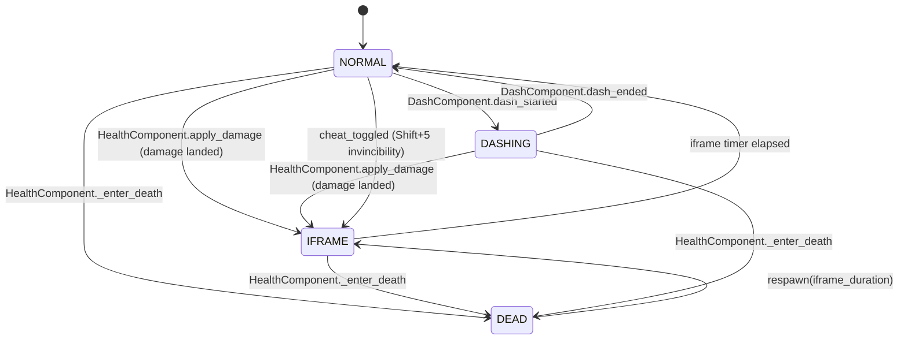

<!-- verified against commit 090ed90 on 2026-04-08 -->

# 03 — Entities and Components

## What you'll know after reading this

- What the four gameplay entities are and how they're composed.
- The 10 components that live inside `Ship`, what each one *does*, and
  how it talks to the entity root.
- The Ship finite state machine and how damage, dash, and respawn
  transitions flow through it.
- The "default-OFF" tick rule, the entity-vs-component boundary, and
  the Node-vs-Node2D gotcha from ADR 010 §7.

## Entity overview

| Entity | Scene | Root script | Physics root | One-line purpose |
|---|---|---|---|---|
| **Ship** | [features/ship/ship.tscn](../../features/ship/ship.tscn) | [features/ship/ship.gd](../../features/ship/ship.gd) (`class_name Ship`) | `CharacterBody2D` | The player — thrusts, turns, fires broadsides, dashes, drops mines, has HP / lives / respawn |
| **EnemyShip** | [features/enemies/enemy_ship.tscn](../../features/enemies/enemy_ship.tscn) | [features/enemies/enemy_ship.gd](../../features/enemies/enemy_ship.gd) (`class_name EnemyShip`) | `CharacterBody2D` | AI ship — chases + circles the player, fires broadsides, terminal death |
| **Cannonball** | [features/weapons/cannonball.tscn](../../features/weapons/cannonball.tscn) | [features/weapons/cannonball.gd](../../features/weapons/cannonball.gd) | `Area2D` | Travels a randomized distance, impacts water with an explosion + displacement stamp |
| **SeaMine** | [features/weapons/sea_mine.tscn](../../features/weapons/sea_mine.tscn) | [features/weapons/sea_mine.gd](../../features/weapons/sea_mine.gd) | `Area2D` | Floats, arms, detonates on proximity, supports chain reactions via `SpawnService` |

Player and enemy ships share the same component vocabulary (Health,
Hurtbox, HitFeedback, Broadside, AudioEmitter, FSM) plus entity-
specific ones (Ship adds Dash, MineDrop, PlayerInput, Movement;
EnemyShip adds `EnemyAIMovement` and takes an `EnemyArchetype`
Resource).

## The 10 components under `features/ship/components/`

Nine of the ten components live in
[features/ship/components/](../../features/ship/components/) and are
children of the `Ship` node; `ShipFSM` is the tenth and lives one
level up at [features/ship/ship_fsm.gd](../../features/ship/ship_fsm.gd)
because it is the entity's state backbone rather than a regular
sibling component. Every signal they emit travels upward to `Ship`,
which either handles it locally or re-emits to the `Events` bus (see
ADR 007).

| Component | File | Role (one verb) | Extends | Emits | Listens to | Tick |
|---|---|---|---|---|---|---|
| **ShipFSM** | [ship_fsm.gd](../../features/ship/ship_fsm.gd) | **track** the ship's current `State` and broadcast transitions | `Node` | `state_changed(prev, next)`, `iframes_started/ended` | own methods (called by Ship + components) | process (iframes decay) |
| **HealthComponent** | [health_component.gd](../../features/ship/components/health_component.gd) | **bookkeep** HP, lives, respawn timer | `Node` | `health_changed`, `lives_changed`, `died`, `respawn_ready`, `game_over` | — | process (while respawning) |
| **HurtboxComponent** | [hurtbox_component.gd](../../features/ship/components/hurtbox_component.gd) | **detect** damaging areas and report hits | **`Node2D`** (see ADR 010 §7 below) | `hit_taken(source, amount)` | child `Area2D.area_entered`, `ShipFSM.state_changed` | signal-only |
| **HitFeedbackComponent** | [hit_feedback_component.gd](../../features/ship/components/hit_feedback_component.gd) | **flash / shake / blink** on damage | `Node` | `screen_shake_requested` (bus — sanctioned exception, ADR 007) | `ShipFSM.iframes_started/ended` | process (while shaking) |
| **MovementComponent** | [movement_component.gd](../../features/ship/components/movement_component.gd) | **steer** thrust + turn + brake + ram pushback | `Node` | `rammed_enemy(enemy, normal)` | `ShipFSM.state_changed`, reads `ShipStats` per frame | physics (always) |
| **DashComponent** | [dash_component.gd](../../features/ship/components/dash_component.gd) | **burst** velocity + flame VFX + cooldown | `Node` | `dash_started`, `dash_ended` | `PlayerInput` press edges | physics + process (while active) |
| **PlayerInputComponent** | [player_input.gd](../../features/ship/components/player_input.gd) | **read** gameplay `Input` actions | `Node` | (method-call relay — no signals) | `ShipFSM.state_changed` (mute when dead) | signal-only |
| **BroadsideComponent** | [broadside_component.gd](../../features/ship/components/broadside_component.gd) | **coordinate** port / starboard cannon volleys | `Node` | `cannon_fired(pos, dir)` | child `Cannon.fired` signals | signal-only |
| **MineDropComponent** | [mine_drop_component.gd](../../features/ship/components/mine_drop_component.gd) | **drop** a mine and publish cooldown progress | `Node` | `mine_dropped(pos)`, `mine_cooldown_changed(progress)` | — | physics (publish cooldown) |
| **AudioEmitterComponent** | [audio_emitter_component.gd](../../features/ship/components/audio_emitter_component.gd) | **emit** audio requests to the bus | `Node` | `sound_requested` (bus — sanctioned exception, ADR 007) | — | signal-only |

The cannons themselves (port + starboard) are `Cannon` instances under
a `CannonSlots/Port/Starboard` marker tree — see
[features/ship/components/cannon.gd](../../features/ship/components/cannon.gd).
`Cannon` is the only "component" that lives next to a ship's visual
marker nodes rather than the flat `Ship/XxxComponent` list, because it
needs a Transform2D anchor for the muzzle position. Components live
with their host entity regardless of where the consumer lives — the
`EnemyShip` reusing the same `cannon.tscn` is the intended outcome
(CLAUDE.md "Components live with their host entity").

## Entity-vs-component boundary

There is exactly one boundary rule worth memorizing:

> **Entities dispatch to the bus. Components emit upward.**

A component's signals are received by the entity root (`Ship` /
`EnemyShip`), which then decides whether to:

1. Call another component's public method (`_apply_damage` →
   `HealthComponent.apply_damage`).
2. Re-emit on `Events` (`cannon_fired` → `Events.cannonball_fired`).
3. Do both.

The two exceptions are documented in ADR 007: `HitFeedbackComponent`
publishes `screen_shake_requested` directly, and `AudioEmitterComponent`
publishes `sound_requested` directly. Both are *terminal-output*
components — their role is literally "turn this local signal into a
bus event" — so routing through the entity root would be a pointless
forwarder.

## The Ship FSM

States live in
[features/ship/ship_fsm.gd](../../features/ship/ship_fsm.gd):

- **`NORMAL`** — accepts input, vulnerable, movement + fire allowed.
- **`DASHING`** — dash impulse + ghost trail active; still vulnerable.
  Dash + IFrame are intentionally *orthogonal*: you can dash *through*
  the iframe window.
- **`IFRAME`** — alive, invulnerable (post-hit or post-respawn or
  debug-cheat). `HurtboxComponent.process_hit` filters by
  `ShipFSM.is_vulnerable()`.
- **`DEAD`** — no input, no damage, no movement. Exited only by
  `respawn(iframe_duration)`, which transitions `DEAD → IFRAME`.

The "flat enum FSM over HSM" choice is ADR 006. The iframe state
*replacing* a boolean `is_invincible` flag is the key win — states
can't contradict each other.

## Damage path, step by step

This is the single signal flow every new reader should internalize.
The Mermaid sequence diagram is in
[02-autoloads-and-signals.md](02-autoloads-and-signals.md); in prose:

1. Enemy `Cannonball` (`Area2D`) enters player `HurtboxComponent`'s
   child `Area2D`.
2. `Ship.take_damage(from_direction, amount)` calls
   `HurtboxComponent.process_hit(self, amount)`.
3. `HurtboxComponent` checks `ShipFSM.is_vulnerable()`; if yes, emits
   `hit_taken(source, amount)`.
4. `Ship._on_hurtbox_hit_taken` → `_apply_damage(amount)` →
   `HealthComponent.apply_damage(amount)`.
5. `HealthComponent` mutates HP, emits `health_changed`; if HP > 0 it
   triggers `ShipFSM.start_iframes(duration)` and
   `HitFeedbackComponent.play_hit()`.
6. If HP ≤ 0, `HealthComponent._enter_death()` calls
   `ShipFSM.enter_dead()`, which emits `Ship.died`. Main reacts by
   calling `WaterEffectsManager.on_player_died`; the ship's own
   `died` handler emits an explosion via `Events.explosion_requested`.
7. After `respawn_delay`, `HealthComponent` emits `respawn_ready`.
   `Ship._on_health_respawn_ready` calls `ShipFSM.respawn(iframe_dur)`
   and re-emits `Ship.respawned`, which Main uses to snap the camera.

## The two tick-mode rules

### Default-OFF

Every component calls `set_physics_process(false)` and
`set_process(false)` in its own `_ready()` unless it proves it needs
ticking. Current exceptions (documented in CLAUDE.md):

- **MovementComponent** — physics always on; it IS the thrust loop.
- **ShipFSM** — process on only while iframes are decaying.
- **MineDropComponent** — physics on to publish per-frame cooldown
  progress for the HUD.

Everything else reacts to signals or method calls.

### Node vs Node2D (ADR 010 §7)

Components that depend on the entity's 2D transform chain (so their
child `CanvasItem`s don't strand at world origin) must
`extends Node2D`, not `extends Node`. `HurtboxComponent` is the
current carve-out — it owns a child `Area2D` that needs the ship's
`global_transform`, and the Phase-10 refactor silently moved its
hit-area to the origin when it was first written as a plain `Node`.
When in doubt, `extends Node2D`. The `Transform2D` cost is negligible.

## EnemyShip in one paragraph

[features/enemies/enemy_ship.gd](../../features/enemies/enemy_ship.gd)
shares the same FSM + component vocabulary as Ship, but swaps
`PlayerInputComponent` for
[features/enemies/enemy_ai_movement.gd](../../features/enemies/enemy_ai_movement.gd)
(chase + orbit), takes an `@export var archetype: EnemyArchetype`
Resource for HP / chase speed / broadside cadence, sets
`HealthComponent.respawnable = false` for terminal death, mutes the
`Shift+5` invincibility cheat, and emits a shorter signal list
(`destroyed(ship, by_mine)` + `cannon_fired`) consumed by
`SpawnService`. The same `cannon.tscn` is reused. Adding a new enemy
archetype = new `EnemyArchetype.tres` + new `WaveConfig` entry; no new
scene or script required unless the behavior itself differs from
chase-and-circle.

## What to read next

- **How signals actually travel** (with a Mermaid sequence of the
  damage path above) →
  [02-autoloads-and-signals.md](02-autoloads-and-signals.md).
- **ShipStats, WaveConfig, EnemyArchetype, and the Resource doctrine**
  → [04-resources-and-vfx.md](04-resources-and-vfx.md).
