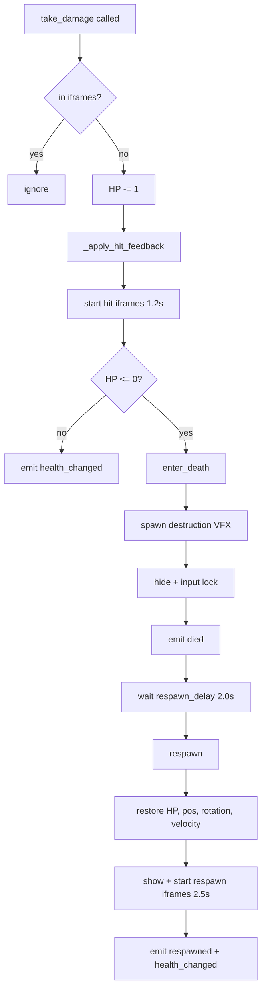

# feat: Player HP, respawn, HP UI, and ship-ship collision damage

## Overview

Give the player a 4-HP health system with the same visual damage feel enemies already have, plus a respawn loop, iframes, a pretty placeholder HUD, and mutual damage on ship-ship rams.

Goals:
1. **HP system** — `max_health = 4`, `_health` tracked on `Ship`. Taking 4 hits destroys the player.
2. **Damage sources wired** — enemy cannonballs, ship-ship collisions (both directions), sea mine blasts. All flow through one public `Ship.take_damage(from_direction)` entry point.
3. **Invincibility frames** — after any hit, ~1.2s of iframes; after respawn, ~2.5s. Iframe state is communicated visually by a blinking alpha flicker on the ship. Damage is fully ignored during iframes.
4. **Death + respawn** — death spawns a destruction VFX, hides the ship, locks input, waits `respawn_delay` (2.0s), restores the ship at its original spawn position with full HP and respawn iframes.
5. **HP UI** — a new `HPDisplay` CanvasLayer overlay in the top-left that matches the existing `ControlsOverlay` aesthetic: chalkboard background + `kims_bit_hand.ttf` font. Four stylised "hull pips" drain left-to-right with a short shrink/fade tween, and respawn plays a staggered pop-in.
6. **Ship-ship collision damage** — existing `Ship._process_collision_pushback` detects enemy collisions; extend to deal mutual damage, with iframes on **both** ships so a single collision event cannot deal multiple hits across sub-collisions / sub-frames.

Not in scope: scoring, difficulty scaling, sound effects, multiple spawn points, HP pickups, checkpointing.

## Problem Statement / Motivation

The player ship already has rich visual hit feedback (camera shake + per-sprite shake + white flash via `Ship.take_hit()` at [scripts/ship.gd:227](scripts/ship.gd#L227)), but no actual health. Enemies fire broadsides and land hits that do nothing, and ship-ship collisions are currently a pure bounce with no stakes. The game has no failure state, which undermines the existing combat loop.

The enemy side already has a clean 4-HP model ([scripts/enemy_ship.gd:99](scripts/enemy_ship.gd#L99)) and hull damage variants ([scripts/ship_config.gd:17](scripts/ship_config.gd#L17)) — we can mirror the exact same architecture on the player with minimal new code.

## Proposed Solution

### Architecture Decisions

| Decision | Choice | Rationale |
|---|---|---|
| HP model | `max_health: int = 4` on `Ship`, identical to `EnemyShip` | Symmetric code paths; reuses the 4 existing hull damage regions (0-3) |
| Hull damage visual | Same spritesheet variant swap as enemy: `damage_variant = max_health - _health` → `ShipConfig.get_hull_region(variant)` | Zero new art; consistent with enemy |
| Public damage API | `func take_damage(from_direction: Vector2) -> void` on `Ship` | Mirrors `EnemyShip.take_damage`; single entry point from cannonball / collision / mine |
| Visual hit feedback | Rename existing `take_hit()` → `_apply_hit_feedback()` (private). `take_damage` calls it internally. | Preserves all existing shake + flash code; same look, new gate |
| Iframes | `_iframes_left: float` counter in `_physics_process`. Damage ignored while > 0. Defaults: 1.2s on hit, 2.5s on respawn. | Counter pattern matches existing cooldowns (`_port_cooldown`, etc.) |
| Iframe visual | Blink tween on ship `modulate:a` (1.0 ↔ 0.35) looping for iframe duration; hard-restore to 1.0 at end. | Classic, readable, no new assets |
| Iframe and flash interaction | Hit flash (white modulate) runs once per hit; the blink loop runs across all iframes. Flash kills the blink tween, runs 0.15s, then blink resumes for the remaining iframe duration. | Keeps both readable; simpler than trying to overlay both on `modulate` |
| Death handling | Hide + disable (NOT `queue_free`) | Preserves Main's signal wiring; simpler respawn |
| Respawn position | Captured in `Ship._ready()` from `global_position` (which Main sets in main.tscn to `Vector2(176, 112)`) | Zero config; respawn = start position |
| Respawn delay | 2.0s exported | Tunable |
| Ship-ship iframes | Added to `EnemyShip` too (same counter pattern). Short default (0.4s) so cannonball damage still lands normally, but ram can't double-hit. | Prevents physics sub-step collisions from applying damage multiple times |
| HP UI | New `scenes/hp_display.tscn` CanvasLayer. Uses same font + chalkboard shader as `ControlsOverlay` for visual parity. 4 pips in HBox at top-left. | Cheap, thematic, matches existing UI style |
| HP pip art | ColorRect with StyleBoxFlat (rounded corner + border + fill) — no texture needed. Weathered cream (filled) / dim gray (lost). | "Placeholder but pretty" requirement met without new assets |
| HP UI → Ship binding | `HPDisplay.setup(ship: Ship)` called from `main.gd._ready`. HPDisplay connects to `health_changed`, `died`, `respawned` signals. | Same pattern as `MinimapDisplay.setup(_ship)` at main.gd:51 |
| Input lock on death | `_input_locked: bool` gate at top of `_unhandled_input` and inside the movement block in `_physics_process` | Simpler than swapping `set_process_*` flags; ship still ticks for shake decay |

### Death / Respawn Flow



### HP UI Layout

```
┌────────────────────────────────┐
│  ┌──┐ ┌──┐ ┌──┐ ┌──┐          │
│  │ ▣│ │ ▣│ │ ▣│ │ ▣│          │
│  └──┘ └──┘ └──┘ └──┘          │
│        chalkboard frame        │
└────────────────────────────────┘
 top-left, ~120x32 px, below any game-start overlay
```

Each pip is a 16x16 ColorRect with a rounded `StyleBoxFlat`. When lost, the pip tweens `scale: (1,1) → (0.6, 0.6)` and `modulate: cream → dim-gray` over 0.2s. On respawn, all four pips pop back in with a 0.06s stagger using the same tween in reverse.

## Technical Approach

### Phase 1 — `Ship` HP + iframe + death/respawn

**[scripts/ship.gd](scripts/ship.gd) — additions:**

```gdscript
signal health_changed(current: int, maximum: int)
signal died()
signal respawned()

const HIT_IFRAME_DURATION: float = 1.2
const RESPAWN_IFRAME_DURATION: float = 2.5
const IFRAME_BLINK_INTERVAL: float = 0.08  # seconds per on/off cycle

@export var max_health: int = 4
@export var respawn_delay: float = 2.0

var _health: int = 0
var _iframes_left: float = 0.0
var _is_dead: bool = false
var _input_locked: bool = false
var _spawn_position: Vector2 = Vector2.ZERO
var _spawn_rotation: float = 0.0
var _blink_tween: Tween = null


func _ready() -> void:
    # ... existing asserts + _apply_config ...
    _spawn_position = global_position
    _spawn_rotation = rotation
    _health = max_health
    # Defer so Main has time to wire signals in its own _ready.
    call_deferred("_emit_initial_health")


func _emit_initial_health() -> void:
    health_changed.emit(_health, max_health)


func take_damage(from_direction: Vector2) -> void:
    if _is_dead or _iframes_left > 0.0:
        return
    _health -= 1
    _apply_hit_feedback()  # formerly take_hit()
    _update_hull_variant()
    health_changed.emit(_health, max_health)
    if _health <= 0:
        _enter_death()
        return
    _start_iframes(HIT_IFRAME_DURATION)


func _update_hull_variant() -> void:
    var variant: int = clampi(max_health - _health, 0, 3)
    _hull_sprite.region_rect = ShipConfig.get_hull_region(variant)


func _start_iframes(duration: float) -> void:
    _iframes_left = duration
    _start_blink_tween(duration)


func _start_blink_tween(duration: float) -> void:
    if _blink_tween and _blink_tween.is_valid():
        _blink_tween.kill()
    _blink_tween = create_tween().set_loops()
    _blink_tween.tween_property(self, "modulate:a", 0.35, IFRAME_BLINK_INTERVAL)
    _blink_tween.tween_property(self, "modulate:a", 1.0, IFRAME_BLINK_INTERVAL)
    # A one-shot cleanup timer restores full alpha at the exact iframe end.
    get_tree().create_timer(duration).timeout.connect(
        func() -> void:
            if is_instance_valid(self) and _iframes_left <= 0.0:
                _end_blink()
    )


func _end_blink() -> void:
    if _blink_tween and _blink_tween.is_valid():
        _blink_tween.kill()
    _blink_tween = null
    modulate.a = 1.0


func _enter_death() -> void:
    _is_dead = true
    _input_locked = true
    _end_blink()
    velocity = Vector2.ZERO
    visible = false
    # Disable collisions without tearing down the node.
    set_collision_layer_value(1, false)
    set_collision_mask_value(2, false)  # enemies
    set_collision_mask_value(5, false)  # enemy projectiles
    ExplosionSprite.create(
        get_parent(), global_position, "enemy_destruction", Vector2.ZERO, Vector2.ZERO
    )
    died.emit()
    get_tree().create_timer(respawn_delay).timeout.connect(
        func() -> void:
            if is_instance_valid(self):
                _respawn()
    )


func _respawn() -> void:
    global_position = _spawn_position
    rotation = _spawn_rotation
    velocity = Vector2.ZERO
    _health = max_health
    _update_hull_variant()
    _is_dead = false
    _input_locked = false
    visible = true
    set_collision_layer_value(1, true)
    set_collision_mask_value(2, true)
    set_collision_mask_value(5, true)
    respawned.emit()
    health_changed.emit(_health, max_health)
    _start_iframes(RESPAWN_IFRAME_DURATION)


# Update _physics_process to decrement _iframes_left and gate input:
func _physics_process(delta: float) -> void:
    if _iframes_left > 0.0:
        _iframes_left -= delta
        if _iframes_left <= 0.0:
            _end_blink()
    if _is_dead:
        return
    # ... existing cooldown decrements ...
    if _input_locked:
        move_and_slide()
        return
    # ... existing movement logic ...


# Update _unhandled_input:
func _unhandled_input(event: InputEvent) -> void:
    if _input_locked:
        return
    # ... existing handling ...


# Rename existing take_hit() → _apply_hit_feedback()
func _apply_hit_feedback() -> void:
    _shake_trauma = maxf(_shake_trauma, HIT_TRAUMA)
    _hit_shake_timer = HIT_SHAKE_DURATION
    if _hit_flash_tween and _hit_flash_tween.is_valid():
        _hit_flash_tween.kill()
    modulate = Color(3.0, 3.0, 3.0, 1.0)
    _hit_flash_tween = create_tween()
    _hit_flash_tween.tween_property(self, "modulate", Color.WHITE, HIT_FLASH_DURATION)
```

**Ship-ship collision damage** — update `_process_collision_pushback`:

```gdscript
func _process_collision_pushback(pushback_scale: float) -> void:
    if pushback_scale <= 0.0:
        return
    for i: int in range(get_slide_collision_count()):
        var collision: KinematicCollision2D = get_slide_collision(i)
        var collider: Object = collision.get_collider()
        if collider is EnemyShip:
            var push: Vector2 = collision.get_normal() * 50.0 * pushback_scale
            velocity += push
            var enemy: EnemyShip = collider as EnemyShip
            # Mutual damage; both sides respect their own iframes.
            take_damage(-collision.get_normal())
            enemy.take_damage(collision.get_normal())
            return  # one collision event per frame is enough
```

The `return` after the first collision prevents multi-hit per frame even if Godot reports multiple sub-collisions. Iframes on both sides then cover the subsequent few frames of physical overlap.

### Phase 2 — `EnemyShip` iframes

**[scripts/enemy_ship.gd](scripts/enemy_ship.gd):**

```gdscript
const RAM_IFRAME_DURATION: float = 0.4

var _iframes_left: float = 0.0


func take_damage(_from_direction: Vector2) -> void:
    if _is_destroyed or is_queued_for_deletion() or _iframes_left > 0.0:
        return
    _iframes_left = RAM_IFRAME_DURATION
    _health -= 1
    # ... rest unchanged ...


func _physics_process(delta: float) -> void:
    if is_queued_for_deletion():
        return
    if _iframes_left > 0.0:
        _iframes_left -= delta
    # ... rest unchanged ...
```

Note: we do **not** blink the enemy — the existing flash + shake is enough feedback. The enemy iframe is purely a multi-hit guard.

### Phase 3 — Cannonball + mine re-wiring

**[scripts/cannonball.gd](scripts/cannonball.gd) — swap `take_hit` → `take_damage`:**

```gdscript
elif is_enemy_owned and body is Ship:
    _impacted = true
    (body as Ship).take_damage(_direction)
    water_impacted.emit(global_position)
    ExplosionSprite.create(get_parent(), global_position, "cannonball_impact", _direction)
    queue_free()
```

**[scripts/sea_mine.gd](scripts/sea_mine.gd) — wire mine blast into player damage:**

```gdscript
# In _apply_blast_damage:
elif body is Ship:
    (body as Ship).take_damage(global_position.direction_to(body.global_position))
    player_damaged.emit(global_position)  # keep signal for future listeners
```

### Phase 4 — HP UI

**New: [scenes/hp_display.tscn](scenes/hp_display.tscn)**

```
HPDisplay: CanvasLayer (layer = 50)
└── Frame: PanelContainer (top-left anchor, ~128x40)
    └── Margin: MarginContainer (theme_override_constants/margin_* = 6)
        └── Pips: HBoxContainer (separation 4)
            ├── Pip0: ColorRect (16x16)
            ├── Pip1: ColorRect (16x16)
            ├── Pip2: ColorRect (16x16)
            └── Pip3: ColorRect (16x16)
```

- `Frame` uses the same `chalkboard_material.tres` as `ControlsOverlay` at a smaller size, OR a `StyleBoxFlat` with weathered cream border (6 corners radius, 2 border width, muted parchment fill).
- Each `PipX` uses a `StyleBoxFlat` applied to a TextureRect/ColorRect. Cream `Color(0.95, 0.93, 0.85)` = filled; dim `Color(0.35, 0.33, 0.3)` = lost.
- Anchors: top-left, `offset_left = 6`, `offset_top = 6`.

**New: [scripts/hp_display.gd](scripts/hp_display.gd)**

```gdscript
class_name HPDisplay
extends CanvasLayer

const FILL_COLOR: Color = Color(0.95, 0.93, 0.85)
const LOST_COLOR: Color = Color(0.35, 0.33, 0.3, 0.6)
const DRAIN_DURATION: float = 0.2
const POP_STAGGER: float = 0.06

var _pips: Array[ColorRect] = []
var _ship: Ship = null


func _ready() -> void:
    for child: Node in $Frame/Margin/Pips.get_children():
        var pip: ColorRect = child as ColorRect
        assert(pip != null, "HPDisplay: expected all pips to be ColorRect")
        pip.color = FILL_COLOR
        _pips.append(pip)


func setup(ship: Ship) -> void:
    _ship = ship
    _ship.health_changed.connect(_on_health_changed)
    _ship.respawned.connect(_on_respawned)


func _on_health_changed(current: int, _maximum: int) -> void:
    for i: int in range(_pips.size()):
        var pip: ColorRect = _pips[i]
        var should_fill: bool = i < current
        if should_fill and pip.color.a < 1.0:
            _tween_pip_restore(pip, 0.0)
        elif not should_fill and pip.color.a >= 0.99:
            _tween_pip_drain(pip)


func _on_respawned() -> void:
    for i: int in range(_pips.size()):
        _tween_pip_restore(_pips[i], i * POP_STAGGER)


func _tween_pip_drain(pip: ColorRect) -> void:
    var tw: Tween = create_tween().set_parallel(true)
    tw.tween_property(pip, "color", LOST_COLOR, DRAIN_DURATION)
    tw.tween_property(pip, "scale", Vector2(0.6, 0.6), DRAIN_DURATION)


func _tween_pip_restore(pip: ColorRect, delay: float) -> void:
    var tw: Tween = create_tween().set_parallel(true)
    if delay > 0.0:
        tw.tween_interval(delay)
    tw.tween_property(pip, "color", FILL_COLOR, DRAIN_DURATION)
    tw.tween_property(pip, "scale", Vector2.ONE, DRAIN_DURATION)
```

**[scenes/main.tscn](scenes/main.tscn) — instance the HPDisplay:**

Add a `[node name="HPDisplay" parent="." instance=ExtResource("hp_display.tscn")]` line after the minimap instance.

**[scripts/main.gd](scripts/main.gd) — wire it in `_ready`:**

```gdscript
@onready var _hp_display: HPDisplay = $HPDisplay

func _ready() -> void:
    # ... existing asserts + wiring ...
    assert(_hp_display != null, "Main: HPDisplay not found")
    _hp_display.setup(_ship)
```

## File Summary

| File | Action | Purpose |
|---|---|---|
| `scripts/ship.gd` | **Modify** | Add HP, iframes, death/respawn, mutual-damage on collision, signals |
| `scripts/enemy_ship.gd` | **Modify** | Add ram iframes |
| `scripts/cannonball.gd` | **Modify** | Swap `take_hit` → `take_damage` call |
| `scripts/sea_mine.gd` | **Modify** | Call `take_damage` on player branch |
| `scripts/main.gd` | **Modify** | Wire HPDisplay in `_ready` |
| `scenes/main.tscn` | **Modify** | Instance HPDisplay |
| `scenes/hp_display.tscn` | **Create** | UI scene (CanvasLayer + Frame + 4 pips) |
| `scripts/hp_display.gd` | **Create** | HP UI logic (signal wiring + tween animations) |

## System-Wide Impact

- **Signal chain**:
  - Cannonball `body_entered` → `Ship.take_damage(dir)` → iframe check → HP-- → `_apply_hit_feedback` → `_update_hull_variant` → `health_changed` → `HPDisplay._on_health_changed` → drain tween.
  - HP ≤ 0 → `_enter_death` → destruction VFX → `died` signal → 2s timer → `_respawn` → `respawned` signal → `HPDisplay._on_respawned` → staggered pop-in.
  - Ship-ship collision in `_process_collision_pushback` → both `take_damage` calls → each side's iframe independently guards further damage.
  - Sea mine blast → `_apply_blast_damage` → `Ship.take_damage(dir)` → same path as cannonball.
- **Error & failure propagation**:
  - Iframe counter decrements in `_physics_process` — can't leak if ship is destroyed mid-iframe because the ship doesn't `queue_free` on death.
  - Blink tween cleanup timer guards with `is_instance_valid(self)` before touching state.
  - Respawn timer guard likewise. `_end_blink` hard-restores `modulate.a = 1.0` so a killed tween can never leave the ship translucent.
  - `_enter_death` zeros velocity to prevent a ghost ship drifting during the hidden state.
- **State lifecycle risks**:
  - Ship never `queue_free`s, so all Main-side signal connections survive the death/respawn cycle. No re-wiring needed.
  - Dash, cannon, and mine cooldowns keep decrementing during death — acceptable, they'll just be ready when the player respawns.
  - If the player dies mid-dash, `_dash_active` stays true and `_end_dash` is never called. **Fix:** call `_end_dash()` inside `_enter_death` if `_dash_active`. Add to the acceptance criteria.
  - Hull variant must reset to 0 on respawn — handled by `_update_hull_variant()` being called with full HP.
- **Scene interface parity**:
  - `EnemyShip.take_damage` and `Ship.take_damage` now share a near-identical iframe guard + HP decrement shape. Consider extracting a shared helper later, but duplication is acceptable for two implementers.
- **Integration test scenarios**:
  1. **Ram while iframe active** — enemy stays in contact across multiple physics ticks: only the first tick damages the player, subsequent ticks are absorbed by iframe.
  2. **Simultaneous cannonball + ram** — enemy cannonball lands on the same frame the player rams it; only one of the two should land because of iframes. Document which: cannonball first (body_entered) → ram second (absorbed). Order is deterministic but the specifics may need a tweak.
  3. **Die during dash** — `_is_dead` must force `_end_dash` so Engine.time_scale returns to 1.0 and the fire effect stops.
  4. **Respawn while enemies nearby** — respawn iframes must prevent instant re-death if an enemy is still inside the player's rect at respawn time.
  5. **Mine chain + player present** — if multiple mines chain-detonate and the player is in range of two, only the first should deal damage; iframes cover the rest.

## Acceptance Criteria

### HP + damage
- [x] `Ship` has `@export var max_health: int = 4` and internal `_health`.
- [x] `Ship.take_damage(from_direction)` is the single public damage entry point.
- [x] Enemy cannonballs call `take_damage` instead of `take_hit`.
- [x] Sea mine `_apply_blast_damage` calls `take_damage` on the player branch.
- [x] Ship-ship collisions call `take_damage` on both sides.
- [x] Hull sprite progressively swaps through the 4 damage variants (0 → 3) as HP drops.
- [x] Camera shake + per-sprite shake + white flash still fire on every hit (existing `_apply_hit_feedback`).

### Iframes
- [x] Damage is fully ignored while `_iframes_left > 0`.
- [x] Hit iframes default to `HIT_IFRAME_DURATION = 1.2s`.
- [x] Respawn iframes default to `RESPAWN_IFRAME_DURATION = 2.5s`.
- [x] Ship visibly blinks (modulate:a 1.0 ↔ 0.35) during iframes.
- [x] Ship modulate:a restored to 1.0 exactly at iframe end (no stuck translucent state).
- [x] Hit flash (white) takes visual precedence during its 0.15s, then blink resumes.
- [x] `EnemyShip` has a `RAM_IFRAME_DURATION = 0.4s` counter preventing multi-hit rams.

### Death + respawn
- [x] On HP ≤ 0, `Ship._enter_death` fires: destruction VFX spawns, ship hidden, input locked, velocity zeroed, collisions disabled, `died` signal emitted.
- [x] If `_dash_active`, `_enter_death` calls `_end_dash` so Engine.time_scale is restored.
- [x] After `respawn_delay = 2.0s`, `_respawn` fires: position/rotation/velocity reset to captured spawn values, HP restored to max, hull variant reset to 0, visible + collisions re-enabled, `respawned` signal + `health_changed` emitted.
- [x] Ship is never `queue_free`'d across the death cycle — Main's signal wiring survives.
- [x] Respawn iframes begin immediately.

### HP UI
- [x] New `scenes/hp_display.tscn` exists with a top-left frame and 4 pips.
- [x] Uses the same `kims_bit_hand.ttf` font and `chalkboard_material.tres` palette as the existing `ControlsOverlay` so visual language matches.
- [x] `HPDisplay.setup(ship)` connects to `health_changed` and `respawned`.
- [x] Pips drain left-to-right on damage with a 0.2s shrink+fade tween.
- [x] Pips pop back in with a 0.06s stagger on respawn.
- [x] `main.tscn` instances `HPDisplay` and `main.gd._ready` calls `setup(_ship)`.
- [x] HP UI is in the top-left and does not overlap the minimap (top-right) or debug overlay.

### Hygiene
- [x] `gdformat --check .` clean.
- [x] `gdlint .` clean.
- [x] `run_project` produces zero new errors during a full play session:
  - Take cannonball hits → HP drains → die → respawn loops correctly.
  - Ram into an enemy → both ships take 1 HP → iframes prevent spam.
  - Mine blast within range → HP drops.
  - Respawn iframes visibly blink and block damage.

## Dependencies & Risks

- **Tween + is_instance_valid cleanup** — `SceneTreeTimer` lambdas for the blink cleanup and respawn delay must guard with `is_instance_valid(self)`. Consistent with existing dash-cooldown pattern in `ship.gd`.
- **Physics sub-step multi-hits** — the `return` after first collision in `_process_collision_pushback` is critical. Without it, rams can deal 2-3 HP in one frame.
- **Enemy iframes vs cannonball DPS** — 0.4s enemy iframe is short enough that a full broadside (2 balls, fired same frame) still lands both hits cleanly because they arrive in the same frame before the iframe is set. If this turns out wrong during testing, lower to 0.1s or gate iframe application on source (ram-only).
- **Hull region reset on respawn** — `_update_hull_variant()` must be called after `_health = max_health` is restored so the sprite region reverts to variant 0.
- **HPDisplay scene order** — must be added AFTER Minimap in main.tscn so it doesn't get drawn below it (both are CanvasLayers with explicit `layer` values anyway — set `layer = 50` to be safe).

## Sources & References

- Player ship: [scripts/ship.gd](scripts/ship.gd), [scenes/ship.tscn](scenes/ship.tscn)
- Enemy ship reference implementation: [scripts/enemy_ship.gd:99](scripts/enemy_ship.gd#L99) (`take_damage`), [scripts/enemy_ship.gd:199](scripts/enemy_ship.gd#L199) (`_start_shake`)
- Cannonball damage path: [scripts/cannonball.gd:57](scripts/cannonball.gd#L57)
- Mine blast damage path: [scripts/sea_mine.gd:191](scripts/sea_mine.gd#L191) — already emits `player_damaged` but has no receiver
- UI style reference: [scenes/controls_overlay.tscn](scenes/controls_overlay.tscn), [scripts/controls_overlay.gd](scripts/controls_overlay.gd)
- Hull damage regions: [scripts/ship_config.gd:17](scripts/ship_config.gd#L17)
- Existing hit feedback (to rename to `_apply_hit_feedback`): [scripts/ship.gd:227](scripts/ship.gd#L227)
- Shared Resource mutation safety: [docs/solutions/shared-resource-mutation.md](docs/solutions/shared-resource-mutation.md)
- Prior enemy combat plan (reference for patterns): [docs/plans/2026-04-07-feat-enemy-ship-shooting-and-water-effects-plan.md](docs/plans/2026-04-07-feat-enemy-ship-shooting-and-water-effects-plan.md)
